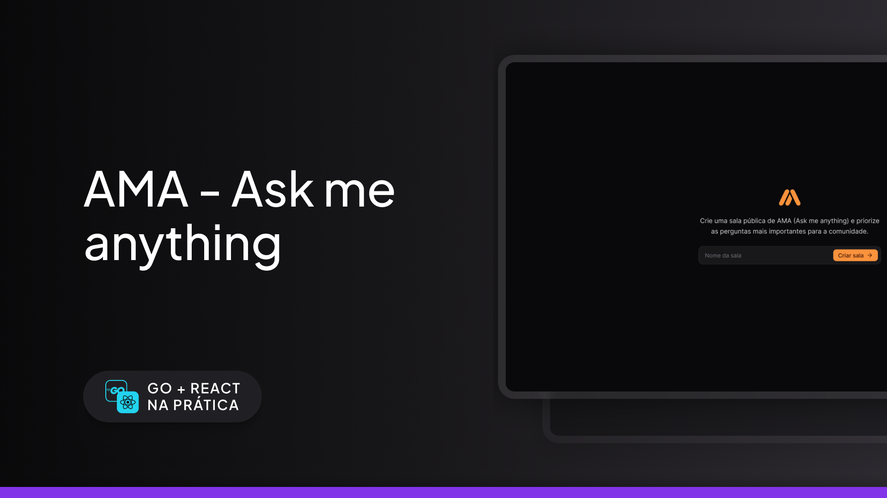

# AMA | Ask me anything



<br />

## About the project

Create a public AMA (Ask me anything) room and prioritize the most important questions for the community.

---

## :rocket: Technologies

This project was developed with the following technologies:

- Server

  - [x] [Golang](https://go.dev)
  - [x] [Chi](https://github.com/go-chi/chi)
  - [x] [PostgreSQL](https://www.postgresql.org)
  - [x] [SQLC](https://sqlc.dev)
  - [x] [Golang Migrate](https://github.com/golang-migrate/migrate)
  - [x] [WebSocket](https://github.com/gorilla/websocket)

- Web

  - [x] [ReactJS](https://reactjs.org)
  - [x] [Vite](https://vitejs.dev)
  - [x] [Tailwindcss](https://tailwindcss.com)
  - [x] [WebSocket](https://developer.mozilla.org/en-US/docs/Web/API/WebSocket)

## :gear: Execute

First clone this repository:

```bash
$ git clone https://github.com/Sup3r-Us3r/ama-app.git
$ cd ama-app
```

### Server

> You need to first install the [golang migrate](https://github.com/golang-migrate/migrate) package to be able to run migrations.

```bash
$ cd server
$ docker-compose up -d
$ make migrate_up
```

### Web

```bash
$ cd web
$ npm i -f
$ npm run dev
```

## :memo: License

This project is under the [MIT license](./LICENSE).
